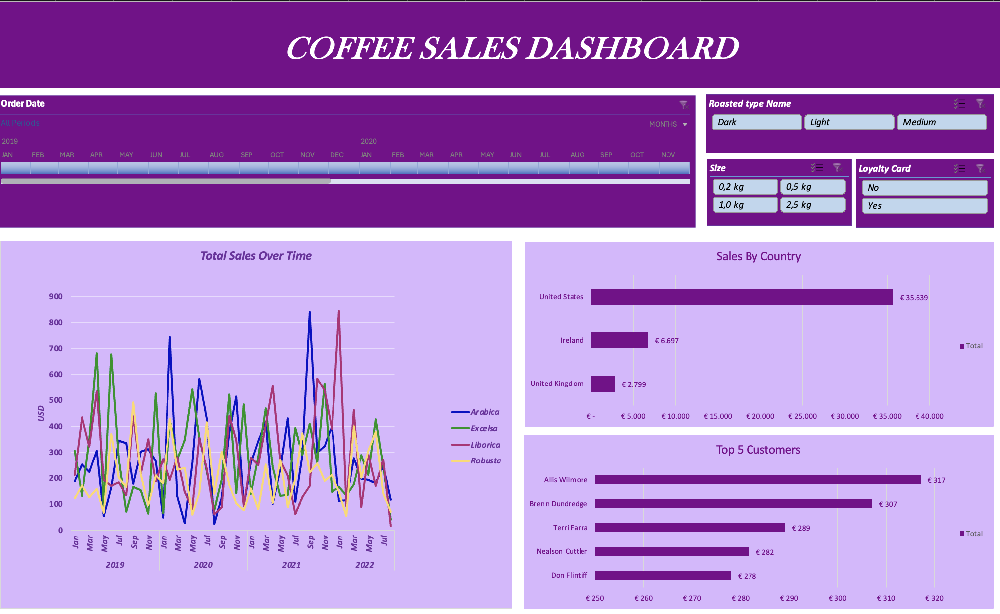

# ☕ Coffee Sales Dashboard

An interactive Excel dashboard created to analyze coffee sales data and provide insights into sales performance, customer behavior, and product preferences.

## 📊 Dashboard Features

- Total sales analysis over time
- Sales breakdown by country
- Top 5 customers based on total sales
- Interactive timeline for filtering by order date
- Dynamic slicers for:
  - Roast type
  - Package size
  - Loyalty card status

## 🛠 Tools & Skills

- Microsoft Excel
- PivotTables
- PivotCharts
- Slicers & Timeline
- Data Analysis
- Dashboard Design
- Data Visualization

## 📁 Project Files

- `coffeeOrdersData.xlsx` – Excel workbook containing the dataset, analysis, and interactive dashboard
- `dashboard.png` – Preview of the completed dashboard

## 🎯 Project Objective

The goal of this project was to transform raw coffee sales data into an interactive and easy-to-understand dashboard, allowing users to explore sales trends and customer insights using dynamic filters.
